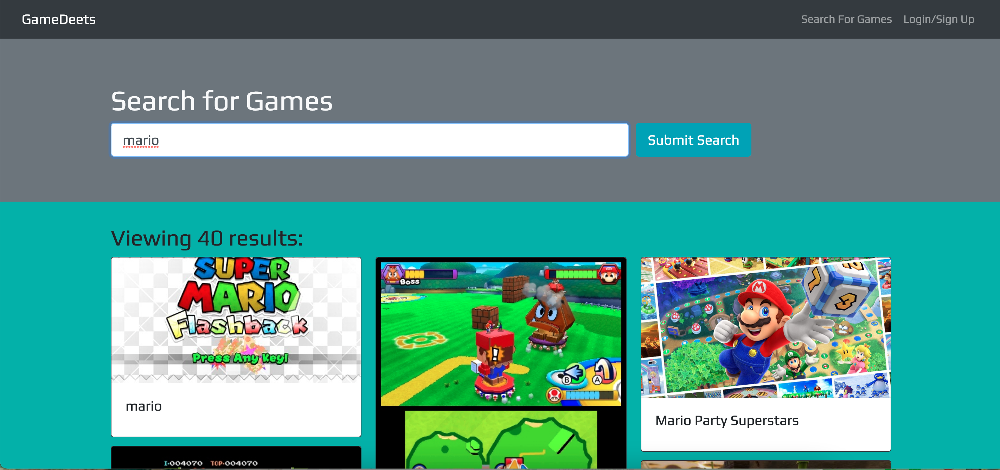
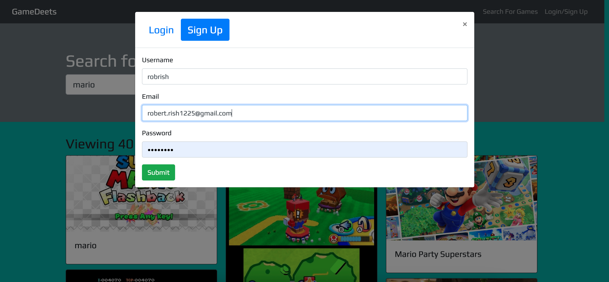

<!-- @format -->

# GameDeets

## Table of Contents

1. [Title](#title)
2. [Description](#description)
3. [Installation](#installation)
4. [Usage](#usage)
5. [Contributing](#contributing)
6. [Screenshots](#screenshots)
7. [License](#license)
8. [Questions](#questions)
9. [Presentation](#presentation)
10. [Links](#links)

## Description

This is a MERN stack application that uses an Apollo Server to use GraphQL queries and mutations to fetch and modify data. The Apollo server is applied to the Express.js server as middleware and authentication is done by way of JSON Web Tokens.

Users are able to search for video games and, once signed up/logged in, can save video games to a list.

## Installation

Run "npm i"

## Usage

Once you open the application, sign up by clicking the "Log In/Sign Up" in the top right-hand corner of the page.  
Search for a game you'd like to add to your "Saved Games" list and click the "Save this game!" button on the game's card.  
To view your list of saved games,  click the "See Your Games" button in the navigation bar.

## Contribution

[Alex Martinez Jr](https://github.com/amartinezjr7)

[Dunia Habhab](https://github.com/duniahabhab)

[Kerry Long](https://github.com/VictoriousOne)

[Rob Rish](https://github.com/RobertRish)

## Screenshots

## License

        MIT License

        Copyright (c) [year] [fullname]

        Permission is hereby granted, free of charge, to any person obtaining a copy
        of this software and associated documentation files (the "Software"), to deal
        in the Software without restriction, including without limitation the rights
        to use, copy, modify, merge, publish, distribute, sublicense, and/or sell
        copies of the Software, and to permit persons to whom the Software is
        furnished to do so, subject to the following conditions:

        The above copyright notice and this permission notice shall be included in all
        copies or substantial portions of the Software.

        THE SOFTWARE IS PROVIDED "AS IS", WITHOUT WARRANTY OF ANY KIND, EXPRESS OR
        IMPLIED, INCLUDING BUT NOT LIMITED TO THE WARRANTIES OF MERCHANTABILITY,
        FITNESS FOR A PARTICULAR PURPOSE AND NONINFRINGEMENT. IN NO EVENT SHALL THE
        AUTHORS OR COPYRIGHT HOLDERS BE LIABLE FOR ANY CLAIM, DAMAGES OR OTHER
        LIABILITY, WHETHER IN AN ACTION OF CONTRACT, TORT OR OTHERWISE, ARISING FROM,
        OUT OF OR IN CONNECTION WITH THE SOFTWARE OR THE USE OR OTHER DEALINGS IN THE
        SOFTWARE.

## Questions

Visit my GitHub page! [RobertRish](https://github.com/RobertRish)
If you have questions feel free to reach out!: robert.rish1225@gmail.com

## Presentation

https://docs.google.com/presentation/d/1VUdvPt41k6BbiBAkzy_2CH7DpYrjvfW5Z_1oq8enILI/edit#slide=id.p

## Links

https://robertrish.github.io/gamedeets/

https://dashboard.heroku.com/apps/immense-lake-44449/deploy/heroku-git
